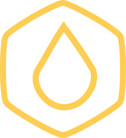
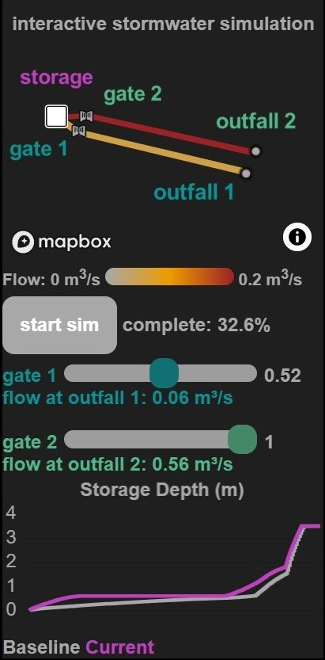
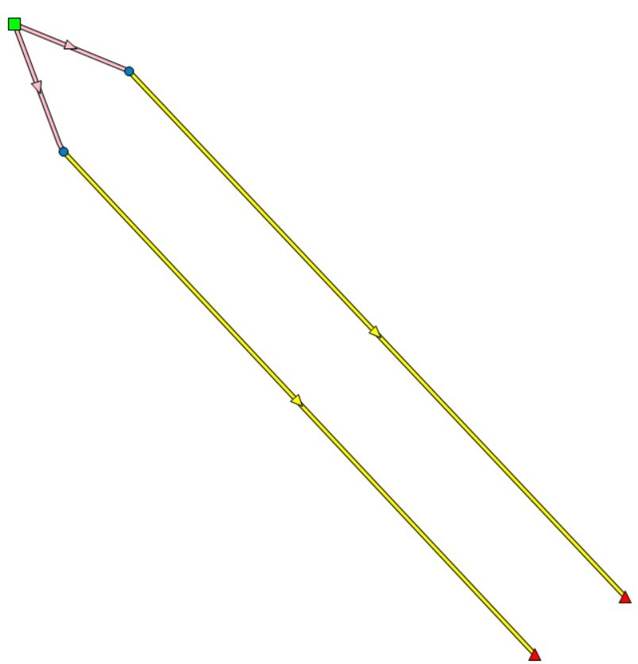
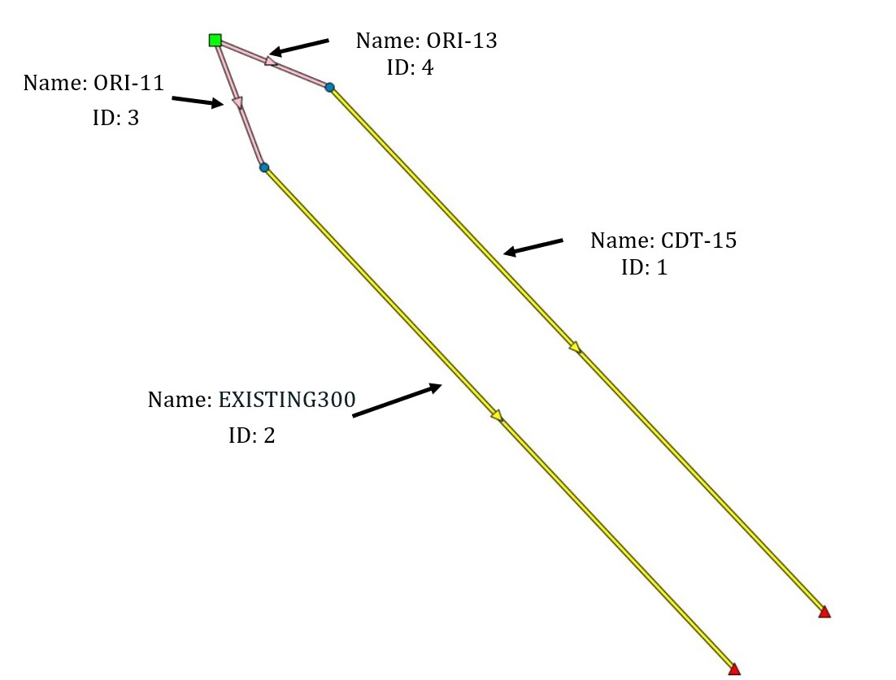
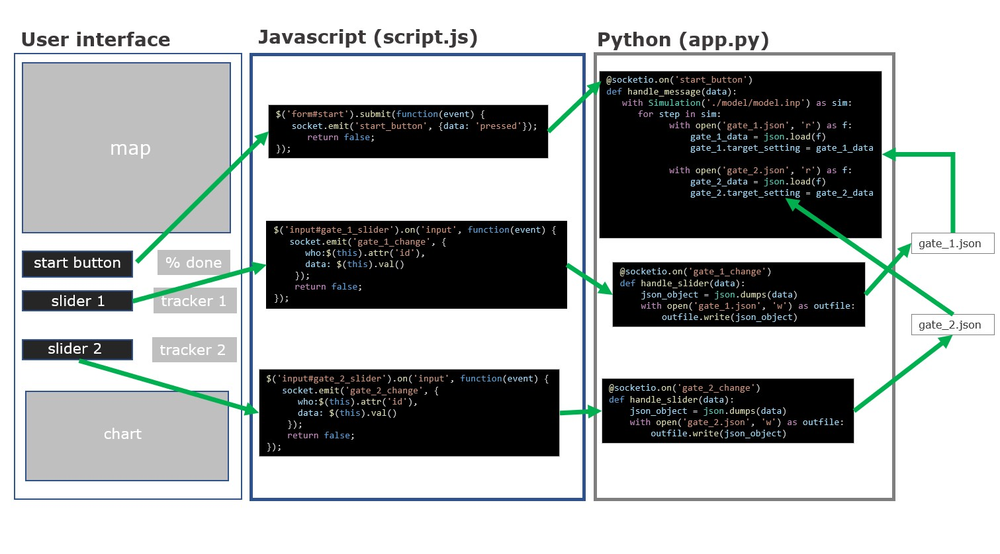

<!-- Improved compatibility of back to top link: See: https://github.com/othneildrew/Best-README-Template/pull/73 -->
<a name="readme-top"></a>
<!--
*** Thanks for checking out the Best-README-Template. If you have a suggestion
*** that would make this better, please fork the repo and create a pull request
*** or simply open an issue with the tag "enhancement".
*** Don't forget to give the project a star!
*** Thanks again! Now go create something AMAZING! :D
-->


<!-- PROJECT SHIELDS -->
<!--
*** I'm using markdown "reference style" links for readability.
*** Reference links are enclosed in brackets [ ] instead of parentheses ( ).
*** See the bottom of this document for the declaration of the reference variables
*** for contributors-url, forks-url, etc. This is an optional, concise syntax you may use.
*** https://www.markdownguide.org/basic-syntax/#reference-style-links
-->


<!-- PROJECT LOGO -->
<br />
<div align="center">
  <a href="https://github.com/royar-hash/interactive-swmm-tutorial">
    
  </a>

<h3 align="center">building an interactive pyswmm web app</h3>

  <p align="center">
    <br />
    <a href="https://github.com/royar-hash/interactive-swmm-tutorial"><strong>Explore the docs »</strong></a>
    <br />
    <br />
    <a href="https://interactive-swmm.herokuapp.com/" target="_blank">View Demo</a>
    ·
    <a href="https://github.com/royar-hash/interactive-swmm-tutorial/issues">Report Bug</a>
    ·
    <a href="https://github.com/royar-hash/interactive-swmm-tutorial/issues">Request Feature</a>
  </p>
</div>


<!-- TABLE OF CONTENTS -->
<details>
  <summary>Table of Contents</summary>
  <ol>
    <li>
      <a href="#about-the-project">About The Project</a>
      <ul>
        <li><a href="#built-with">Built With</a></li>
      </ul>
    </li>
    <li><a href="#getting-started">Step One: Preparing Your Geospatial Data</a></li>
    <li><a href="#usage">Step Two: Set up Your App</a></li>
    <li><a href="#roadmap">Step Three: Passing Data from the UI to Python</a></li>
    <li><a href="#contributing">Step Four: Passing Data from Python to the UI</a></li>
          <ul>
              <li><a href="#built-with">Update Text</a></li>
              <li><a href="#built-with">Update a Chart</a></li>
              <li><a href="#built-with">Update a Map</a></li>
          </ul> 
    <li><a href="#license">Step Five: Run Your App</a></li>
    <li><a href="#license">Step Six: Iterate!</a></li>
    <li><a href="#license">Ideas</a></li>
    <li><a href="#contact">Contact</a></li>
    <li><a href="#acknowledgments">Acknowledgments</a></li>
  </ol>
</details>


<!-- ABOUT THE PROJECT -->
# About The Project
This tutorial will walk you through the basic architecture of building an interactive SWMM web app using Flask-SocketIO and Mapbox GL JS.

Normally, running a SWMM simulation is pretty boring. You set a control strategy, hit start, and then you pretty much can't see or do anything until the simulation is done running. 

This flexible, adaptable web app architecture combines the modeling power of SWMM with the interactivity and real-time visualization of actual stormwater systems! Think of it as a game-like simulation, kind of like Rollercoaster Tycoon, except I didn't write it in assembly and for sewers. Sewer Tycoon&trade;. 

You can change the status of controllable assets <i>as the simulation is running</i> and immediately visualize the effects of your actions. Unlike running a typical SWMM simulation, you aren't locked into a control strategy from the start and you can see exactly what's going on inside the model. 

This project is a product of Professor Branko Kerkez's <a href='http://www-personal.umich.edu/~bkerkez/'>Digital Water Lab</a> at the University of Michigan. <br>

Here's what the example app looks like. Click <a href='https://interactive-swmm.herokuapp.com/'>here</a> to see and interact with the finished product.<br>


<p align="right">(<a href="#readme-top">back to top</a>)</p>

## Built With
* <a href="https://docs.mapbox.com/mapbox-gl-js/guides/">Mapbox GL JS</a>
* <a href="https://flask-socketio.readthedocs.io/en/latest/">Flask-SocketIO</a>
* <a href="https://www.pyswmm.org/">pyswmm</a>
* <a href="https://www.chartjs.org/">Chart.js</a>

<p align="right">(<a href="#readme-top">back to top</a>)</p>


<!-- GETTING STARTED -->
# Step One: Preparing Your Geospatial Data

1. Pick your SWMM model! For this tutorial, we're going to use this simple model with two orifices, a storage node, two conduits, and two outfalls. Here's what our sample model looks like in PCSWMM. If you want to download the model yourself and take a look, it can be found in this repository at <code>model/model.inp</code>. <br>


2. Decide what assets from your SWMM model you want to be able to dynamically visualize (the things you want to change color or size as the simulation is running). In this case, we want to be able to see the flow in the four links. The link names and IDs are shown below.<br>


3. Export the assets you picked as GeoJSON files. In PCSWMM, you can do this via the 'Export' button. If you want, you can modify the file with the Python package geopandas or another tool - since the GeoJSON from SWMM will probably have lots of information you don't need, this can be helpful to simplify things. Each asset you want to visualize MUST have a unique numeric id. Here's what the GeoJSON looks like for the links in our example model.

<h5 a><strong><code>links.geojson</code></strong></h5>

```json
{
"type": "FeatureCollection",
"crs": { "type": "name", "properties": { "name": "urn:ogc:def:crs:OGC:1.3:CRS84" } },
"features": [
{ "type": "Feature", "properties": { "id": "1", "Name": "CDT-15" }, "geometry": { "type": "LineString", "coordinates": [ [ -127.541829345687319, 35.183023046142772 ], [ -127.541448648467139, 35.182925678088793 ] ] } },
{ "type": "Feature", "properties": { "id": "2", "Name": "EXISTING300" }, "geometry": { "type": "LineString", "coordinates": [ [ -127.541838783547476, 35.182976748811171 ], [ -127.541476299031828, 35.182882774764849 ] ] } },
{ "type": "Feature", "properties": { "id": "3", "Name": "ORI-11" }, "geometry": { "type": "LineString", "coordinates": [ [ -127.541896415203198, 35.18301601810515 ], [ -127.541842694367915, 35.182978920293252 ], [ -127.541838783547476, 35.182976748811171 ] ] } },
{ "type": "Feature", "properties": { "id": "4", "Name": "ORI-13" }, "geometry": { "type": "LineString", "coordinates": [ [ -127.541896415203198, 35.18301601810515 ], [ -127.541829345687319, 35.183023046142772 ] ] } }
]
}
```
4. If you don't have a free Mapbox account, now is the time to make one! Click <a href='https://account.mapbox.com/auth/signup/'>here</a> to create your account. Once you've made your account, click on 'Create a token' on your dashboard and make a secret token with tilesets:write, tilesets:read, and tilesets:list permissions. Make sure to save your secret token somewhere you won't lose it! You'll need it in the next step.

5. Take your GeoJSON file or files and upload to Mapbox as tilesets using the <a href="https://docs.mapbox.com/help/tutorials/get-started-mts-and-tilesets-cli/">Mapbox Tilesets CLI</a>. You have to use the method linked; just uploading stuff in Mapbox Studio won't work for our purposes. Here's an example recipe used to upload the example GeoJSON.

<h5 a><strong><code>recipe.json</code></strong></h5>

```json
{
  "version": 1,
  "layers": {
    "links": {
      "source": "mapbox://tileset-source/YOUR_MAPBOX_USERNAME/links-source",
      "minzoom": 12,
      "maxzoom": 16
    }
  }
}
```

# Step Two: Set Up Your App
1. Create a directory and virtual environment for your app.
```bash
$ mkdir your-app-directory
$ cd your-app-directory
$ python3 -m venv venv
```
2. Activate your virtual environment and install the following dependencies with the package installer. 
```bash
$ source venv/bin/activate
(venv) ~/your-app-directory $
```

```bash
pip install pyswmm
pip install flask
pip install flask-socketio
pip install eventlet
pip install pandas
```
The list of packages above is just a start. You may need to install other packages depending on what you want to do with your app. 

3. Within your project directory, create the file structure below. There are four main files you'll need to create: app.py, style.css, script.js, and index.html. The app.py should be in the main directory, the style and script files in the 'static' folder, and the index file in the 'templates' folder. 
```
├── your-app-directory
│   ├── model
│   │   ├── swmm-model.inp
│   ├── static
│   │   ├── script.js
│   │   ├── style.css
│   ├── templates
│   │   ├── index.html
│   ├── app.py
```

# Step Three: Passing Data from the UI to Python
For our example app, we have a start button and two sliders on the user interface: one for each orifice in the SWMM model. Our goal is to achieve the following: 
* When the start button is pressed, the PySWMM simulation starts to run
* When the user changes the slider, the new value of the slider is set as the target setting of the corresponding controllable asset. For example, if the user moves the gate 1 slider all the way down to 0, we want to set the target setting of ORI-11 in the SWMM model to 0 as well. 

## Start Button
The basic idea for the start button is as follows:
* Create a button in HTML. 
* Write a socket.emit() function that is triggered when the button is pressed. 
* Write a corresponding socket.on() function in Python that contains your PySWMM loop. 
Here's what the code snippets for the start button look like.

<h5 a><strong><code>templates/index.html</code></strong></h5>

<h5 a><strong><code>templates/index.html</code></strong></h5>

```html
```
  
<h5 a><strong><code>static/script.js</code></strong></h5>

```javascript
```
  
<h5 a><strong><code>app.py</code></strong></h5>

```python
```
## Controllable Asset

The basic idea for a controllable asset is this: 
* Write a socket.emit() function that throws out the data that you want on the backend. For example, for the sliders, you want a function that throws out the new value every time the user changes the position of the slider. 
* Write a corresponding @socket.on() function in Python that captures and does something with the data you send with your socket.emit() function. For the sliders, this means processing that data and then updating a json file with the latest information. Then, that json file is read at every step of the PySWMM loop and the data used to update the target position of the controllable asset. <br>

Note that you could adapt this to pass anything from the user interface back to Python; the same principle will work if you have an off/on switch on the UI that you want to turn a pump on or off in PySWMM, for example. 

Here's what the code snippets for a controllable asset look like. 

<h5 a><strong><code>templates/index.html</code></strong></h5>

```html
```
  
<h5 a><strong><code>static/script.js</code></strong></h5>

```javascript
```
  
<h5 a><strong><code>app.py</code></strong></h5>

```python
```
  
Here's a visual of what the basic architecture looks like for passing data from the user interface to Python. 



# Step Four: Passing Data from Python to theUI
Obviously, just passing data from the user interface to Python makes for a pretty boring web app. We want to be able to update the UI as the simulation is running so that the user can see the impact of their actions.
## Updating Text
This is the easiest one to do, so we'll start here. Use this method when you want to update some text on the UI: maybe the current flow of a link, the percentage of the simulation that's complete, or the current status of a slider bar. 
<h5 a><strong><code>templates/index.html</code></strong></h5>

```html
<div class='tracker' id="outfall_1_tracker"></div>
```
<h5 a><strong><code>app.py</code></strong></h5>

```python
emit('outfall_1_update',{'data':' '+str(round(outfall_1_flow_emit,2)})
```

<h5 a><strong><code>static/script.js</code></strong></h5>

```javascript
    socket.on('outfall_1_update', function(msg) {
        $('#outfall_1_tracker').text($('<div/>').text(msg.data).html());
    })
```

## Updating a Chart
We do this with Chart.js. 
<h5 a><strong><code>templates/index.html</code></strong></h5>

```html
<canvas id='chart'></canvas>
```

<h5 a><strong><code>app.py</code></strong></h5>

```python
emit('storage_update',storage_depth)
```

<h5 a><strong><code>static/script.js</code></strong></h5>

```javascript
socket.on('storage_update', function(depth) {
    chart.data.datasets[0].data.push(depth)
    chart.update()
});
```
## Updating the Map
This is where Mapbox gets involved. Note that Mapbox's setFeatureState supports more than just color! See <a href='https://docs.mapbox.com/mapbox-gl-js/api/map/#map#setfeaturestate'>here</a> for more info. There are lots of options here to use this architecture in a totally different way. 
```html
<div id="map"></div>
```

<h5 a><strong><code>app.py</code></strong></h5>

```python
emit('flow_update', flow_json)
```

<h5 a><strong><code>static/script.js</code></strong></h5>

```javascript
socket.on('flow_update', function(flow_json) {
    const flow_obj = JSON.parse(flow_json)
    for (const flow_item of flow_obj) {
        map.setFeatureState({
            source: "links",
            sourceLayer: "links",
            id: flow_item.geoid},
            {conduit_flow:flow_item.flow}
        );
    };
});
```

## Step Five: Run Your App
```bash
(venv) $ python3 app.py
```

## Step Six: Iterate!
Make things look different by modifying the 'style.css' file. Change the map colors in JavaScript. Configure the plot to show something other than depth. Use a totally different SWMM model! The options are endless. 

## Note
This is not an exhaustive tutorial and is only meant to illustrate the general principals involved in creating an interactive SWMM web app. For more details, dig into the example files provided in this repository. 

<p align="right">(<a href="#readme-top">back to top</a>)</p>


<!-- USAGE EXAMPLES -->
## Ideas

* Dynamic visualizations


<p align="right">(<a href="#readme-top">back to top</a>)</p>


<!-- LICENSE -->
## License

Distributed under the MIT License. See `LICENSE.txt` for more information.

<p align="right">(<a href="#readme-top">back to top</a>)</p>


<!-- CONTACT -->
## Contact

Ariel Roy - royar@umich.edu
<br>[](https://www.linkedin.com/in/ariel-roy/)

<p align="right">(<a href="#readme-top">back to top</a>)</p>


<!-- ACKNOWLEDGMENTS -->
## Acknowledgments

* [Jacquelyn Schmidt]()
* [Curt Wolf]()
* [Branko Kerkez]()
* [The Great Lakes Water Authority]()

<p align="right">(<a href="#readme-top">back to top</a>)</p>


<!-- MARKDOWN LINKS & IMAGES -->
<!-- https://www.markdownguide.org/basic-syntax/#reference-style-links -->
[contributors-shield]: https://img.shields.io/github/contributors/github_username/repo_name.svg?style=for-the-badge
[contributors-url]: https://github.com/github_username/repo_name/graphs/contributors
[forks-shield]: https://img.shields.io/github/forks/github_username/repo_name.svg?style=for-the-badge
[forks-url]: https://github.com/github_username/repo_name/network/members
[stars-shield]: https://img.shields.io/github/stars/github_username/repo_name.svg?style=for-the-badge
[stars-url]: https://github.com/github_username/repo_name/stargazers
[issues-shield]: https://img.shields.io/github/issues/github_username/repo_name.svg?style=for-the-badge
[issues-url]: https://github.com/github_username/repo_name/issues
[license-shield]: https://img.shields.io/github/license/github_username/repo_name.svg?style=for-the-badge
[license-url]: https://github.com/github_username/repo_name/blob/master/LICENSE.txt
[linkedin-shield]: https://img.shields.io/badge/-LinkedIn-black.svg?style=for-the-badge&logo=linkedin&colorB=555
[linkedin-url]: https://www.linkedin.com/in/ariel-roy/

